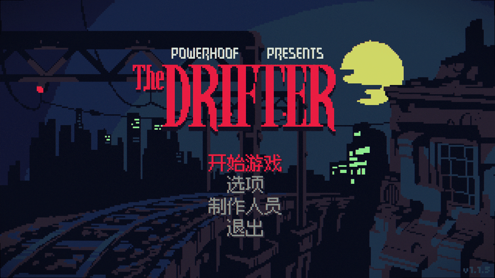
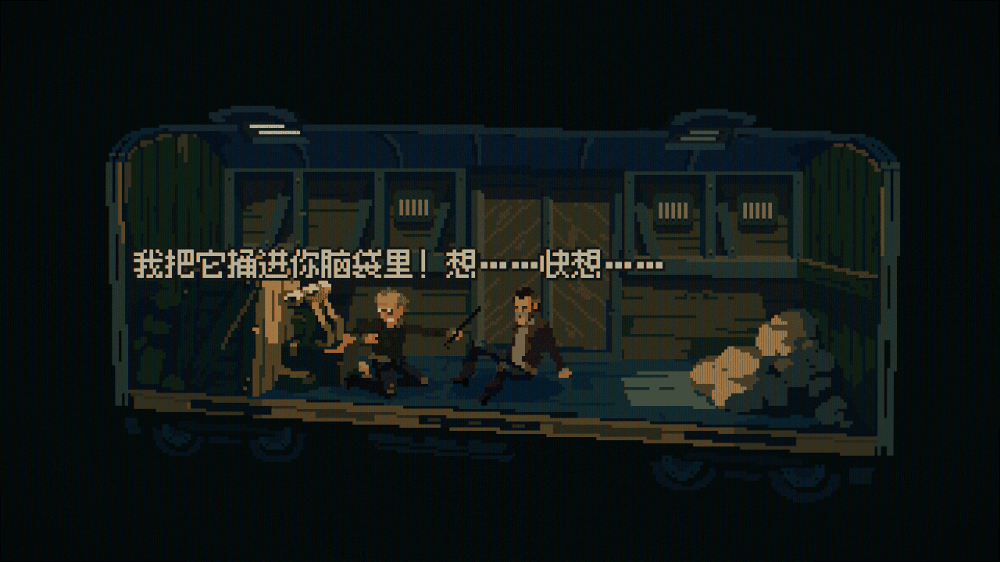
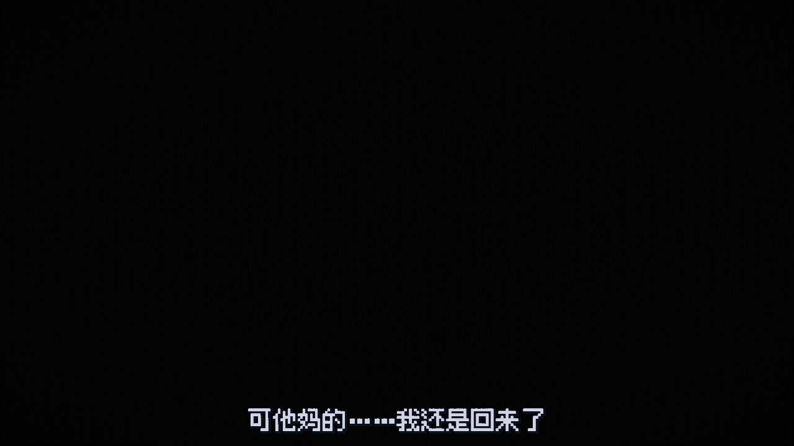
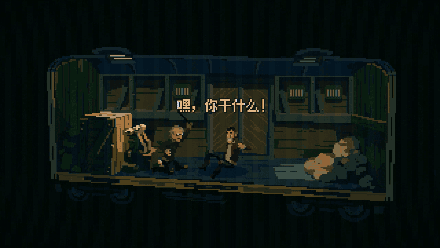
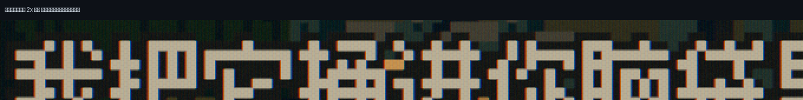

# The Drifter 简体中文汉化

[The Drifter](https://store.steampowered.com/app/1959740/The_Drifter/)（Powerhoof，2025）的非官方简体中文汉化补丁。

全部 **9803 条**游戏文本，含剧情对白、物品描述、线索板、菜单与成就。

> **适用版本**：Steam `Default Public Version`（游戏内版本 **v1.1.5**，buildid **22758595**，2026-04-13 更新）
> 补丁带文件校验，版本不符会直接拒绝安装，不会损坏游戏。
> 若你的版本不同，欢迎开 issue 告知，我会补上对应版本的补丁。



<table>
<tr>
<td></td>
<td></td>
</tr>
</table>




## 安装

1. 到 [Releases](https://github.com/wjunlin293-tech/TheDrifter-SimplifiedChinese/releases) 下载最新的 `TheDrifter-SC-vX.X.zip`
2. 解压，**完全退出游戏**
3. 双击 `安装.bat`
4. 启动游戏；如果还是英文，去 `Options → Language` 选「简体中文」

脚本会自动定位游戏目录（Steam 多库、GOG、自定义路径都会找）。找不到就把游戏目录拖进窗口回车。
游戏装在 `Program Files` 下时会请求管理员权限。

**卸载**：双击 `卸载.bat`。原版文件备份在游戏目录的 `_汉化备份` 里。

> Steam 更新或「验证游戏文件完整性」会覆盖补丁，重新运行一次 `安装.bat` 即可。

## 汉化说明

### 字幕是真·像素字体



中文不是"把黑体缩小塞进去"，而是换上了同为点阵的**像素字形**，与游戏原版英文出自同一套视觉语言。

- 中文字形取自开源像素字体 [Fusion Pixel Font](https://github.com/TakWolf/fusion-pixel-font)，按游戏原字体的像素网格逐字缩放对齐
- **原版英文字形 100% 原封不动**：逐个轮廓比对，对白字体 208 个、主菜单字体 182 个原有字形，**改动 0、丢失 0**
- 字号与行距按原版逐一调校：独白/对话 10px、主菜单 12px，与英文版排版节奏一致
- 覆盖 GB2312 全字集 + 译文实际用到的生僻字，共新增 6505 / 7250 个字形，不会出现方块

### 翻译还原度

- **全部 9803 条，逐句人工翻译**，没有一句机翻
- 保留原作黑色电影的粗粝语气——主角的自嘲、脏话、俚语照译不误，不做净化
- `<Narr>` 第一人称旁白按内心独白处理，口语化，不翻成书面语
- 术语、人名、地名全程统一，跨 25 个剧本文件人工校对
- 人名地名保留英文（Mick、Roth、Trinity Biotech），绰号保留中文（桶屠夫、穆林吉、沙漠豌豆）——专有名词不生硬音译，绰号保留语感

### 不只是翻译

游戏引擎只在空格处换行，中文整句会被当成一个"单词"，长句直接溢出屏幕两侧。
本补丁重写了引擎的断行逻辑：汉字之间可断行、英文单词不拆开、标点避头尾，并保持英文模式行为不变。

## 已知限制

- 图片里的文字（标题 Logo、场景招牌等）仍是英文——那些是美术资源，不在文本范围内。
- Steam 成就的名称与描述来自 Steam 后台，非游戏内文本，因此仍显示英文。

## 补丁是怎么工作的

为避免分发游戏本体内容，仓库里**不包含任何游戏文件**，只有二进制差分：

| 文件 | 说明 |
|---|---|
| `patch/translation.csv` | 译文本体（本项目原创） |
| `patch/CjkWrap.dll` | 中文断行实现（本项目原创，MIT） |
| `patch/assets.delta` | 字体资源差分，安装时与**你自己的**游戏文件合成 |
| `patch/firstpass.delta` | 引擎断行逻辑差分，同上 |
| `patch/BinDelta.exe` | 差分工具，源码见 `src/tools/pack/BinDelta.cs` |

差分带 SHA-1 校验：游戏文件版本对不上会直接拒绝安装，不会把游戏改坏。

## 从源码构建

需要 Python 3.12（含 `fonttools`、`UnityPy`）与 Windows 自带的 .NET Framework 编译器。

```powershell
# 1. 译文 JSON -> translation.csv
python src/tools/make_csv.py

# 2. 合并中文字形进游戏字体，并写回 assets
python src/tools/fontmerge.py work/used_chars.txt
python src/tools/patch.py

# 3. 编译断行补丁
cd src/tools/dllpatch
& $csc /nologo /codepage:65001 /nostdlib /noconfig /target:library /out:build\CjkWrap.dll "/r:$Managed\mscorlib.dll" CjkWrap.cs
& $csc /nologo /codepage:65001 /target:exe /out:build\Patcher.exe /r:build\Mono.Cecil.dll Patcher.cs
.\build\Patcher.exe $Managed <原版firstpass.dll> build\patched.dll build\CjkWrap.dll

# 4. 生成差分包
src/tools/pack/BinDelta.exe create <原版文件> <补丁后文件> patch/xxx.delta
```

译文源文件在 `src/trans/*.json`，键为文本下标，值为译文。改完重新执行第 1 步即可。

## 协议

- 译文与本项目代码：[MIT](LICENSE)
- 中文字形：[Fusion Pixel Font](https://github.com/TakWolf/fusion-pixel-font)，[SIL Open Font License 1.1](licenses/OFL.txt)
- 本补丁与 Powerhoof 无关，游戏本体版权归原作者所有。使用前请确保你拥有正版游戏。

## 致谢

Powerhoof 做出了这款了不起的游戏。如果你还没买，[去支持一下](https://store.steampowered.com/app/1959740/The_Drifter/)。
